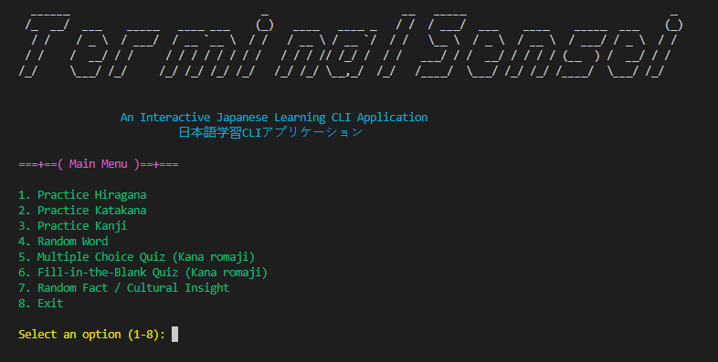

# TerminalSensei 💻🎌 
### Interactive Japanese Learning CLI Application (日本語学習CLIアプリケーション)

<p align="center">
  
</p>

## 📖 Overview
**TerminalSensei** is an interactive command-line application built with Python to help users practise fundamental Japanese writing systems: **Hiragana**, **Katakana**, and **Kanji**.

The application provides an engaging terminal-based learning experience through structured navigation, quizzes, and discovery features such as random words and cultural insights.

---

## ✨ Features & User Stories

### As a user I should be able to do the following :
- Display a Hiragana characters chart.
- Display a Katakana characters chart.
- Display a Kanji characters chart.
- Search Hiragana character details by romaji (symbol, romaji, strokes, example).
- Search Katakana character details by romaji (symbol, romaji, strokes, example).
- Search Kanji character details by number (symbol, onyomi, kunyomi, meaning, strokes, example).
- Get a random Japanese word.
- Take a multiple-choice quiz (kana romaji).
- Take a fill-in-the-blank quiz (kana romaji).
- Get a random Japanese fact / cultural insight.

### Usage - Application Flow (Main Menu):
When the application starts, users can navigate through the following options:

1. Practice Hiragana
   - a. Display Hiragana Chart
   - b. Search Hiragana Character Details by Romaji
   - c. Back to Main Menu
2. Practice Katakana
   - a. Display Katakana Chart
   - b. Search Katakana Character Details by Romaji
   - c. Back to Main Menu
3. Practice Kanji
   - a. Display Kanji Chart
   - b. Search Kanji Character Details by Number
   - c. Back to Main Menu
4. Random Word
5. Multiple Choice Quiz (Kana romaji)
6. Fill-in-the-Blank Quiz (Kana romaji)
7. Random Fact / Cultural Insight
8. Exit

---

## 🚀 Installation & Setup

### Prerequisites:
- Python 3.10 or higher.
- Git installed.

### 1. Clone the repository:

```bash
git clone https://github.com/FadhelAlmalki/UNIT-PROJECT-1.git
cd UNIT-PROJECT-1
```

### 2. Create a virtual environment and activate it:

##### Windows:
```bash
python -m venv venv
venv/Scripts/activate
```
##### macOS/Linux:
```bash
python -m venv venv
source venv/bin/activate
```

### 3. Install dependencies:

```bash
pip install -r requirements.txt
```

### 4. Run the application:
   
```bash
python main_menu.py
```
